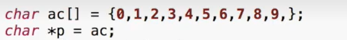
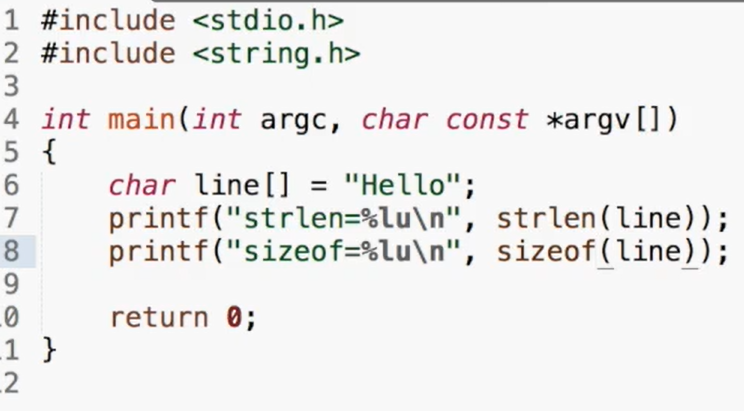
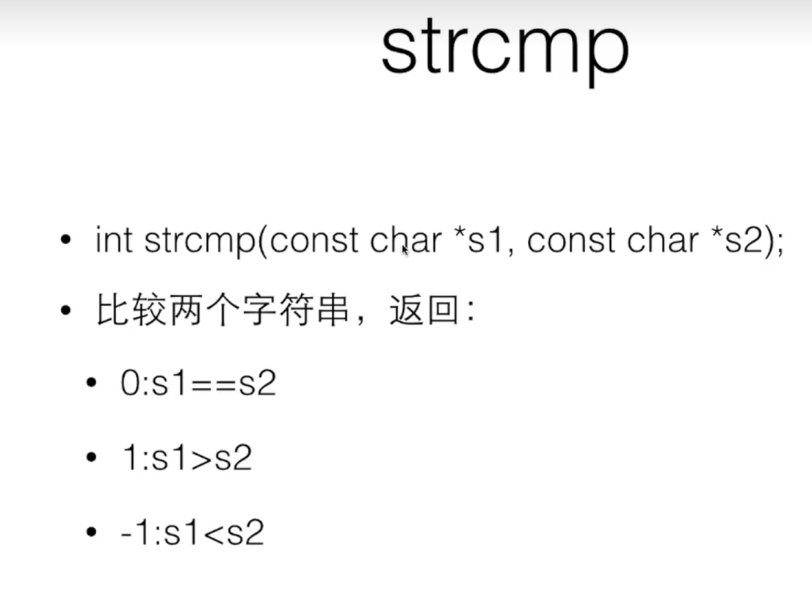
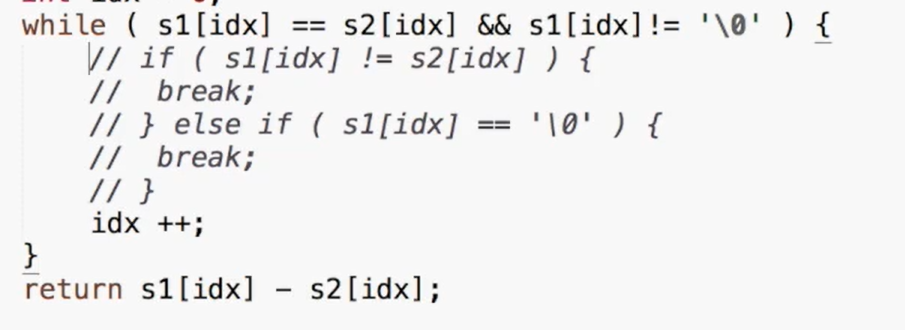

# C语言指针

## 指针的应用：

## 1. 用来传变量：

``` chuanzhi
void swap(int &pa,int&pb)
{
	int t=*pa;
	*pa= *pb;
	*pb=t;
}
```

## 2.传值

``` chuanzhi
void  minmax(int a[],int len,int *max,int *min){
	
}
```


## 3.让函数返回特殊的不属于有效范围内的值来表示出错

就是函数传回去的是1 或 0而用指针来去传递值


## 指针易错点：

对于*p不能直接就用成野指针

int *p=0;就寄了

## 数组？

传入数组的值变成了什么？作为参数出现

参数表里的int a[]d等价与 int *a

数组变量是特殊的指针a==&a[0]

int*p=a;

也可以给a加*

*a

## 数组变量是一个const的值  int a[]=const int *a;


const 加在*的前面还是后边

 可以const int a[]保护一下

这样定义


## 指针运算

指针加1指加一个sizeof（）（对应的类型）

相邻单元差距刚好是基础单元的大小，

所以*（p+n）==p[n];

```zhizhenyunsuan
char *p=&ac[0]
char *p1=&ac[5]
p1-p?

```

指针减法给出来的是sizeof的

*p++很有利于遍历

for (p=ac;  *p!=-1;p++)

{

​	

}

或者`while(*p!=0)`

{ printf("%d\n",*p++)}

常用于数组的连续操作

指针还可以比较地址的大小，线性排列

## 地址与基础

0地址，可能会用NULL 作为0地址

意思是返回的是无效的

# 类型转换

``int *p=&i;void *q= (void*)p`

# 动态输出内存

`int *a=(int *)malloc(n*sizeof(int))`

```malloc
#include<stdlib.h>
#include<stdio.h>

int main()
{

	int number;
	int *a;
	printf("shurushuzi");
	scanf("%d",&number);
	a=(int*)malloc(number*sizeof(int));
	
	for (i=0;i<number;i++)
	{
		scanf("%d",&a[i]);
	}
	
	for(i=number-1;i>=0;i--)
	{
		printf("%d",a[i]);
	}
	free(a)
}
```

如果系统malloc用完了，那就返回NULL

申请过的空间要还给系统,只有malloc来的能free，但是可以free一个NULL

==有一个好习惯y指针定义出来就赋0==

## EOF

### 在getchar中的一些细节

#### 中间有一个东西叫SHELL，没有回车东西都留在缓冲区中

## 字符串数组

```二维数组
 char a[][10]={
 }
// 两种方式是不同的
 char *a[];
```

### 	代替Switch case

​	`int main(int argc,char const *argv[])`

​			argc意思是命令


### 	string.h

#### 			strlen:

​	

strlen是5，sizeof是6

原理就是:不知道有多大，用while循环

###   		 strcmp：



相当于前-后

而且如果两者不相等，则会给出两者的差值

空格也会占用数组

```daima
int mycmp(const char* s1,const char *s2)
{
	int idx=0;
	while(1){
		if(s1[idx]!=s2[idx]){
			break;
		}idx++;
	}	
}
```



```##
int mycmp(const char *s1,const char *s2)
{
	while(*s1==*s2&&*s1!='\0')
	{
		s1++;
		s2++;
		break;
	}
	return *s1-*s2;
}
```

## 										strcpy

第一个是目的，第二个是源   而且有返回，

··`char *dst=(char*)malloc(strlen(src)+1);`

`strcpy(dst,src)`

==别忘记加1==

```strcpy
 #include<stdio.h>
 #include<string.h>
 
 char*mycpy(char*dst,const char*src){
 	int idx=0;
 	while(src9[idx]){
 		dst[idx]=src[idx];
 		idx++;
 	}
 	dst[idx]='\0';
 	
 	//x下面是一个指针模式
 	char*ret =dst;
 	while(*dst++=*src++);
 	//
 	while(*src){
 		ret++;
 		dst++
 		
 	}
 	*det='\0';
 	return ret;
 }
```

##   				strchr

返回指针，要没找到就是NULL

```strchr
char s[]="HELLO";
char *p=strchr(s,'L');
char*t=(char*)malloc(strlen(p)+1);
strcpy(t,p);

printf("%s",p)
//有一个小技巧
*p=0;
printf("%s",s);
//就能输出前面的数了
*p=c;
```

## 					strstr

在字符串组中找字符串
