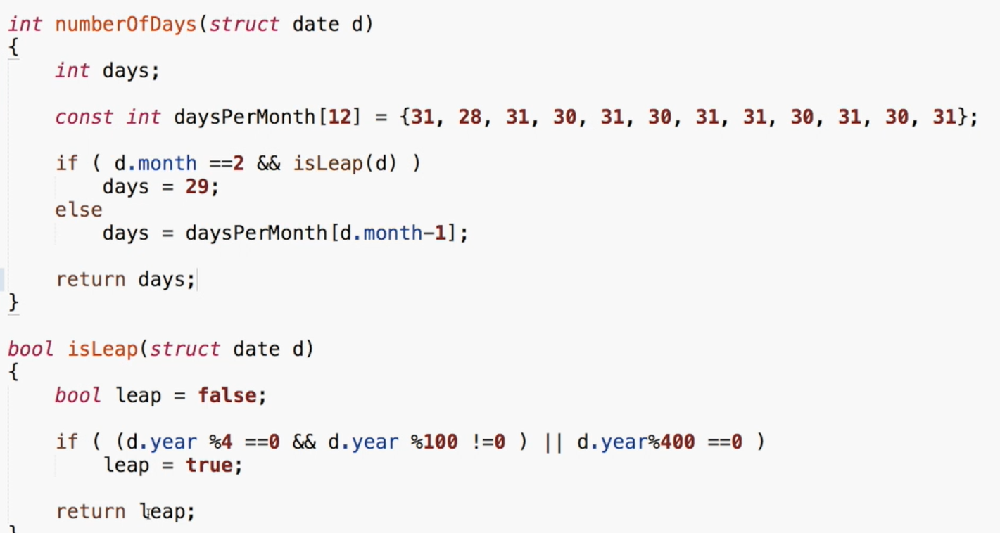
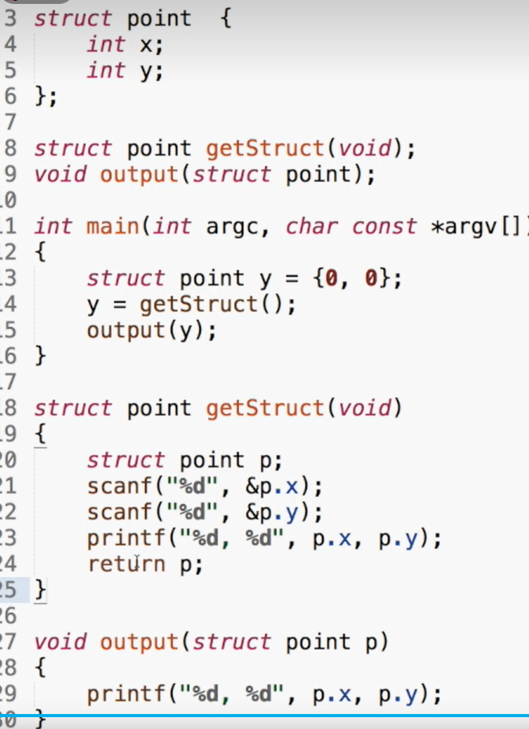
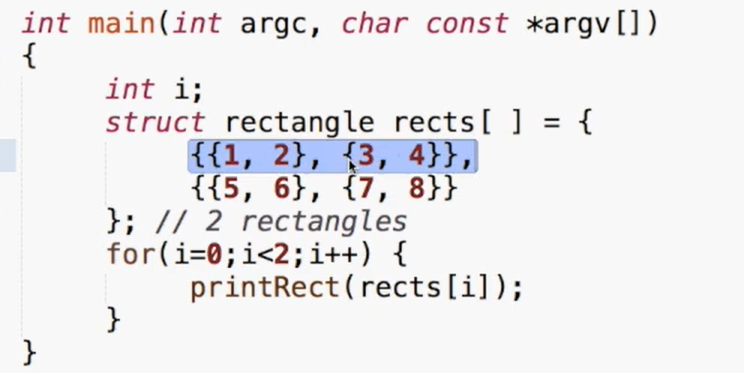
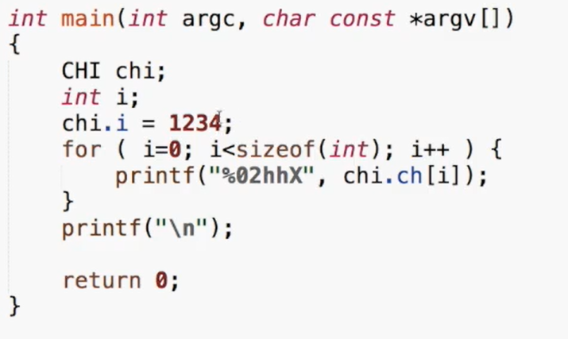
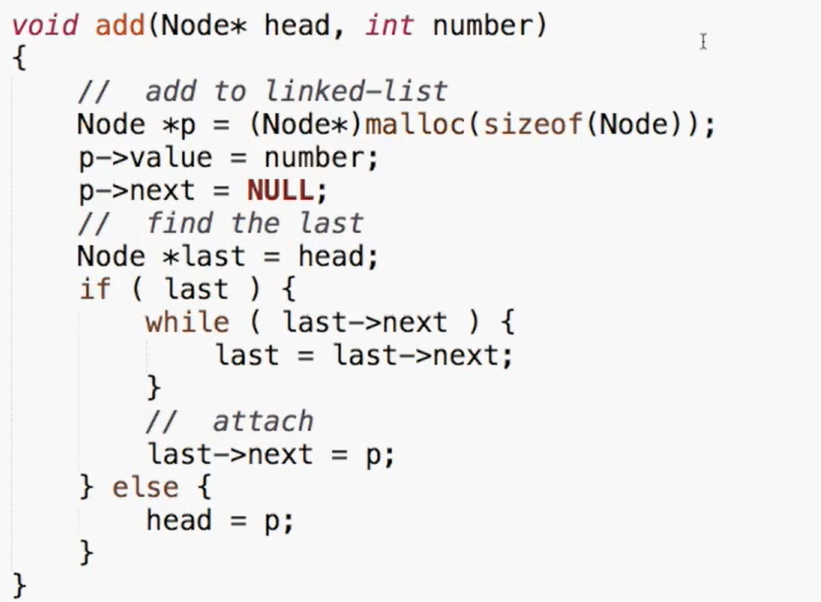
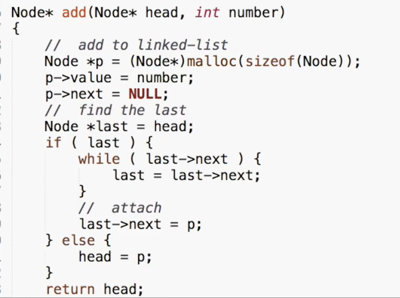
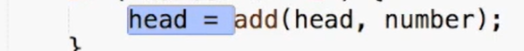
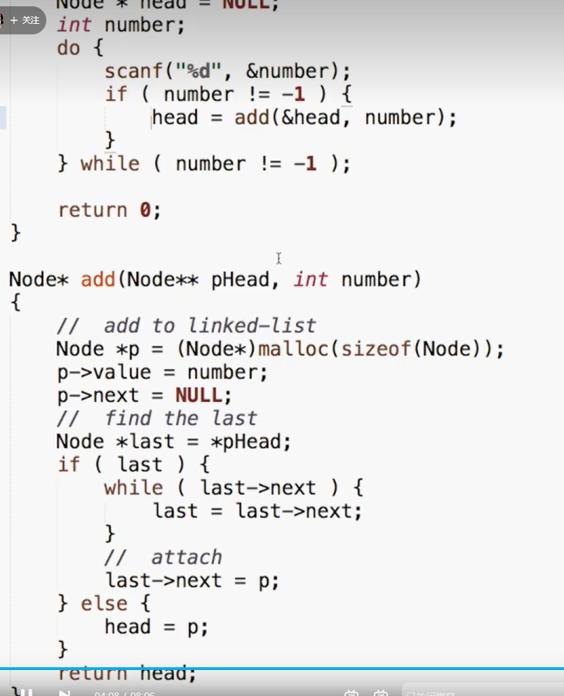
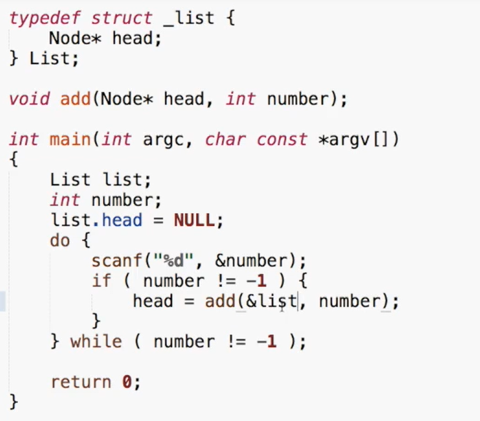
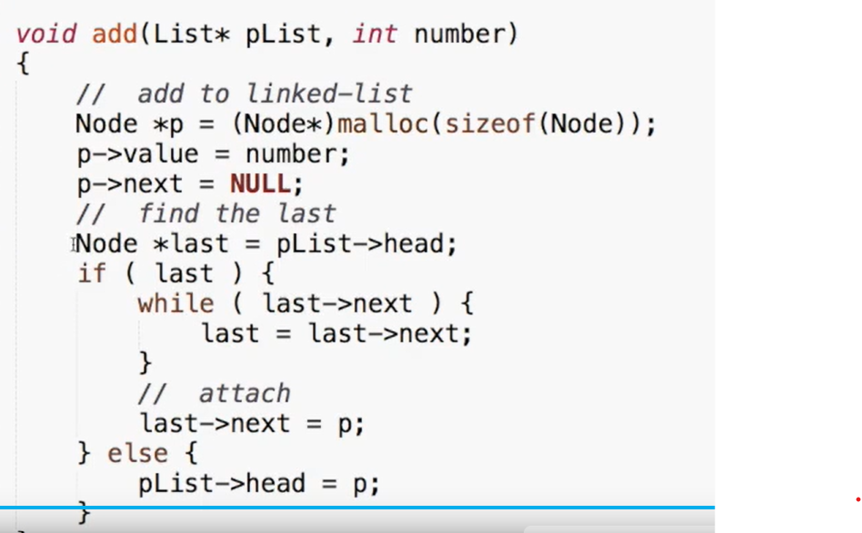

# C语言结构

## `pl=(struct point){5,10}`

结构变量的名字不是地址必须取地址加&

## 结构可以作为函数参数

### `int numberofdayss(struct date d)`

### 输入结构：结构的值可以传过去，但传的只是克隆体

### 解决：用这样的结构

```int main(int argc, char const *argv[])
#include<stdio.h>

struct point {
	int x;
	int y;
};
struct point getstruct(void);

int main(int argc,char const *argv[])
{
	struct point y={0,0};
	y=getstruct();
	output(y);
}

struct point getstruct(void)
{
	struct point p;
	scanf("%d",&p.x);
	scanf("%d",&p.y);
	printf("%d, %d",p.x,p.y);
	return p;
}；

void output(struct point p)
{
	printf("%d, %d",p.x,p.y);
}
```

所以可能更好的方式是传指针

```pointer to the struct
struct date{
	int month;
	int day;
	int year;
}myday;

struct date*p=&myday;
(*p).month=12;
p->month=12;//这两个等价表示指针所指的结构的结构变量的成员 
```

把结构放在最外面；

.的左边必须是一个结构

==不要漏分号==

先声明结构类型，再用结构变量

### 初始化结构

`struct date today={07,31,2014};`

`struct date thismonth={.month=7,.year=2014}`

给的值就用给的，没给的就用0

 ```struct
 struct date today;
 today=(struct date ){07,31,2014}
 }
 ```

### 结构变量的名字不是地址

的用&取到他的地址

## 可以让结构在函数中存在

```struct
scanf("%i %i %i",&today.month,&today.day,&today.year);
if(today.day!=numberOfdays(today)){
	tomorrow.day=today.
}

int numberOfdays(struct date d)
{
	int days;
	const int daysPerMonth[12]={31,28,31,30,31,31,30,31,30,31};
	if()
	
}
```



输入结构

```strucrt
void getstruct(struct point p)
{
	sacnf(,&p,x);
	printf()
}
```

这个例子告诉我们把一个结构传入函数只是传入一个克隆体

解决```

```struct
struct point getstruct(void)
{
	struct 
}
```



而我们有更好的方法，传指针指向结构的指针->表示指针


## 结构中的结构

```struct
struct point{
	int x;
	int y;
	
};
struct rectangle{
	struct point pt1;
	struct point pt2;
};

struct rectangle r,*rp;
rp=&r;
r.pt1.x==rp->pt1.x==(r.pt1).x
r.pt2.x=

```



## c语言 typedef

```typedef
typedef struct Adate{
	int month;
	int year;
	int day;
} Date;

Date d={0,4,2358};
```

可以简化结构，让定义更加简单

# union

```union
union anelt{
	int i;
	char c;
	
}elt1,elt2;

elt1.i=4;
elt1.
```




目前是低位在前，得到一个int 或 double 的内部字段

## resizable array\

做一个可变数组

## 链表

```list- 


typedef struct _node{
	int value;
	struict _node *next;
}Node;

int main(int argc,char const *argv[])
{	
	Node*head=NULL;
    int number;
    do{
    	scanf("%d",&number);
    	if(number !=-1){
    		Node *p =(Node *)malloc(sizeof(Node));
    		p->value=number;
    		p->next=NULL;
    		//find the last
    		Node *last=head;
    		if(last){
    			while(last->next){
    				last=last->next;
    			}
    			//attach
    			last->next=p;
    		}else {
    			head=p;
    		}
    	}
    }
    
}
```

add 函数



不要用全局变量

可以




第三个方法



第四种




```chain
int main(int argc,char const *argv[])
{
	List list;
	int number;
	list.head=NULL;
	do{
		scanf("%d",&number);
		if(number!=-1){
			head=add(&list,number);
		}
	}while(number!=-1) ;
	Node *p;
	for (p=list.head;p;p=p->next){
		printf("%d\t",p->value);//遍历
	}
	
	for(p=list.head;p;p=p->next){
		if(p->value==number)
		{
			printf("找到了")；
			isFound=1;
			break;
		}
	}
	if(!isFound){
	 peintf("未找到")；
	}
	return 0;
}

void add
```

把上述改为print的函数 在for的第三个不一定要++--


## 删除

```delate
//两件事情：把前面那个node指向后一个链表，free p
Node*q;
for(q=Null,q=list.head;p;q=p,p=p->list)
{
	if(p->value==number){
		if(q){
			q-next=p->next;//有一个边界条件就是q不是NUL
		}else{
			list.head=p->next;
		}
		free(p);
		break;
	}
}//最机械的方法，不需boundary要保证所有代码的安全；
```

## 把所有链表清除干净

```clean
for(p=head;p;p=q){
	q=p->next;
	free(p);
}
```


